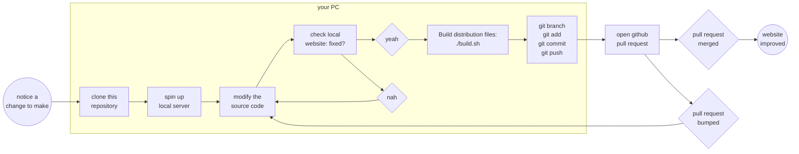

# UniverseTBD
The `main` branch of this repo publishes automatically to our website, [UniverseTBD.org](https://universetbd.org).

## References
- Vue Template: [vue-material-kit-master](https://www.creative-tim.com/product/vue-material-kit),
- [Vue Configuration Reference](https://cli.vuejs.org/config/),

## Typical scenario

In commands, the local part of that process looks like:
```bash
# clone this repository
git clone git@github.com:UniverseTBD/universeTBD.github.io

# spin up local server
cd universeTBD.github.io
docker compose up

# modify the source code
code .
# ...
# ...
# ...

# check local website
# (open your favourite browser to http://localhost:3000/ )
xdg-open http://localhost:3000/

# build distribution files:
./build.sh

# git
git branch jays-cheeky-feature  # name your branch informatively
git checkout jays-cheeky-feature  # checkout your branch locally
git add *  # make sure there isn't any noise in your directory first
git commit -m "put in a cheeky new feature"  # add a commit message

# push your branch to github
git push --set-upstream origin jays-cheeky-feature 

# now go to https://github.com/UniverseTBD/universeTBD.github.io
# and open a pull request of your branch `jays-cheeky-feature` 
# into `main`.
```

The website [UniverseTBD.org](https://universetbd.org) updates automatically from the `main` branch, which is why pushing directly to main should be avoided unless you really know what you're doing.
## Spinning up local server
### Docker Compose (preferred)
Currently the best way to develop this website is to use:
```bash
docker compose up
```
This will:
 - spin up a docker container,
 - install the required `npm` dependencies in the container,
 - link the container to your local `src` files for hot reloading,
 - launch the web server,
 - expose port 3000 to your local machine, so you can open `localhost:3000`, or `youripaddress:3000` on any device on your local network,

### Without docker

If you don't have docker installed, then you'll need to have `npm` installed locally. Then, you can install the project dependencies locally with:

```bash
npm install
```

Once installed, you can compile with hot-reloading for development:
```bash
npm run dev
# If you want to do testing in LAN, eg your mobile phone
npm run dev -- --host 0.0.0.0
```

If you aren't developing and you just wish to compile, you can run:
```bash
npm run build
```
which also produces the minified project for distribution. Note that there is a convenience script `./build.sh` which does this (and some other tasks). You can check if the production build looks OK in your local environment:
```bash
npm run preview
```

## Adding a link to the navbar
The navbar (and footer) uses data from the `navigation.json` file. There are two types of links:
### Group links
Group links will display as dropdown menus, and are structured as:
```json
{
  "name": "About",        // Dropdown Heading
  "icon": "dashboard",    // Icon name, from Material Icons*
  "links": [              // A list of links to display in the dropdown
    {
      "name": "About UniverseTBD",    // Link text in dropdown
      "url": "about"                  // Url, matches name in /routes/index.js
    },
    {
      "name": "Sponsors",
      "url": "about-sponsor"
    }
  ]
}
```
*[Material Icons](https://fonts.google.com/icons?selected=Material+Icons)

### Individual links
Display as an individual link without a navbar. Has following structure:
```
{
    "name": "Research",  # Link Heading
    "icon": "school",    # Icon name, from [Material Icons](https://fonts.google.com/icons?selected=Material+Icons)
    "url": "about"       # Url, matches the name defined in /routes/index.js
}
```